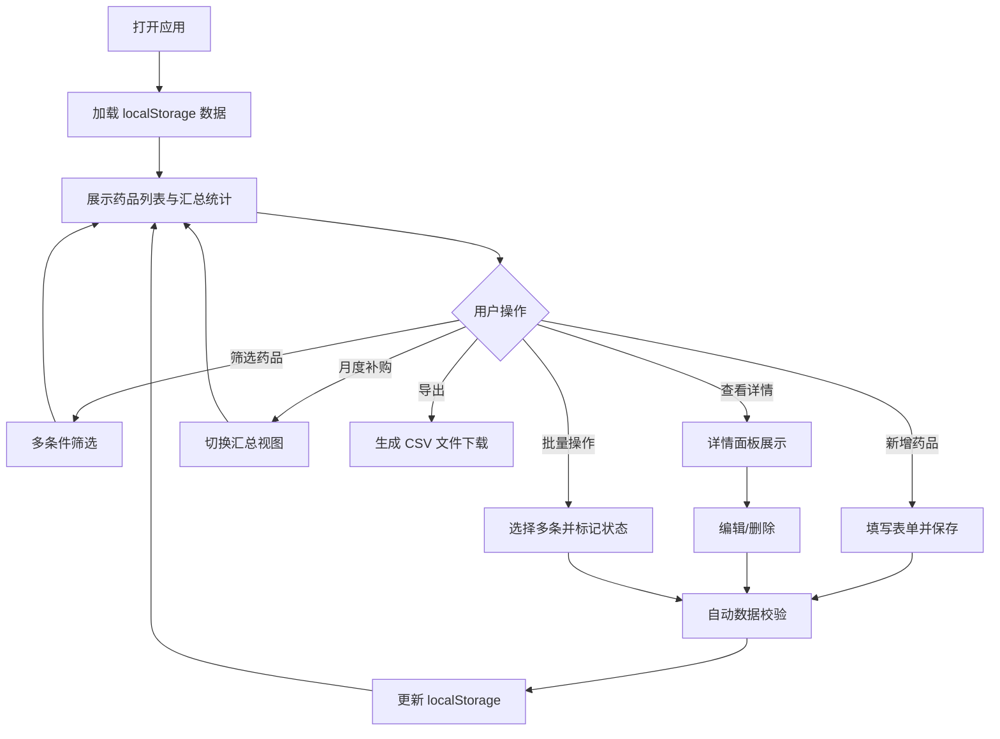

## 1. 产品概述

家用药箱管理系统是一款面向家庭用户的轻量级药品管理工具，帮助用户系统化管理家庭常备药品，实时监控药品库存和有效期，智能生成补购计划，避免药品过期或缺药带来的健康风险。

- 核心价值：药品信息可视化、到期预警自动化、补购计划智能化
- 目标用户：需要管理家庭常备药品的普通家庭用户

## 2. 核心功能

### 2.1 用户角色

| 角色 | 注册方式 | 核心权限 |
|------|----------|----------|
| 家庭用户 | 无需注册，本地使用 | 药品增删改查、筛选、批量操作、数据导出 |

### 2.2 功能模块

1. **药品清单管理**：药品记录的增删改查，包含完整药品信息字段
2. **到期提醒**：自动检测临期和过期药品，高亮显示
3. **补购计划**：智能识别低库存药品，生成待补购清单
4. **数据校验**：自动检查数据完整性和一致性问题
5. **筛选与批量操作**：多维度筛选，批量标记药品状态
6. **月度补购清单**：汇总展示需要关注的药品，按类别统计
7. **数据导出**：支持 CSV 格式导出药品数据

### 2.3 页面详情

| 页面名称 | 模块名称 | 功能描述 |
|----------|----------|----------|
| 主页面 | 顶部汇总区 | 显示药品总数、临期数量、低库存数量、待补购数量统计卡片 |
| 主页面 | 筛选条 | 支持按类别、到期月份、数量状态、存放位置、使用状态筛选 |
| 主页面 | 药品表格 | 展示药品列表，支持多选、排序、快速状态标记 |
| 主页面 | 详情面板 | 右侧滑出，展示和编辑单条药品完整信息 |
| 主页面 | 批量操作栏 | 批量标记"待补购""已补购""临期关注""停止使用" |
| 主页面 | 月度补购模式 | 切换展示临期、低库存、说明不完整记录，按类别汇总 |
| 主页面 | 新增/编辑弹窗 | 完整表单录入药品信息 |

## 3. 核心流程

用户打开页面后，首先看到药品列表和汇总统计。可以通过筛选条件快速定位目标药品，点击行查看详情或进行编辑。当药品临近过期或库存不足时，系统自动高亮并纳入补购计划。用户可切换到"月度补购清单"模式查看需要关注的药品汇总，也可批量标记状态，最后通过导出功能将数据保存为 CSV 文件。

## 4. 用户界面设计

### 4.1 设计风格

- **主色调**：深青色（#0D9488）作为医药主题色，搭配白色背景
- **辅助色**：琥珀色（#F59E0B）标记临期，玫红色（#E11D48）标记过期/异常，绿色（#10B981）标记正常
- **按钮风格**：圆角 8px，轻微阴影，悬停时加深背景色
- **字体**：使用系统无衬线字体（-apple-system, "PingFang SC", "Microsoft YaHei"），标题字重 600，正文字重 400
- **布局风格**：顶部汇总卡片 + 中间筛选操作区 + 下方表格 + 右侧详情面板的经典管理后台布局
- **图标风格**：使用 Lucide 图标库，线条简洁统一

### 4.2 页面设计概览

| 区域名称 | 模块名称 | UI 元素 |
|----------|----------|---------|
| 页面头部 | 标题与操作区 | 应用名称、新增按钮、导出按钮、视图切换开关 |
| 顶部汇总 | 统计卡片 | 4 个带图标的数据卡片，显示总数、临期、低库存、待补购 |
| 筛选条 | 筛选控件 | 多组下拉筛选器 + 搜索框 + 重置按钮 |
| 操作区 | 批量操作 | 选中计数 + 4 个批量状态按钮 |
| 主内容区 | 数据表格 | 带复选框的表格，支持排序，状态列使用标签徽章 |
| 侧边面板 | 详情表单 | 滑出式面板，完整表单字段，保存/删除按钮 |
| 月度视图 | 汇总清单 | 按类别分组展示，显示数量汇总 |

### 4.3 响应式

- 桌面端优先（1280px+），完整展示表格和侧边详情面板
- 平板端（768px-1279px）：详情面板改为全屏弹窗，表格水平滚动
- 移动端（<768px）：汇总卡片两列布局，表格改为卡片列表
