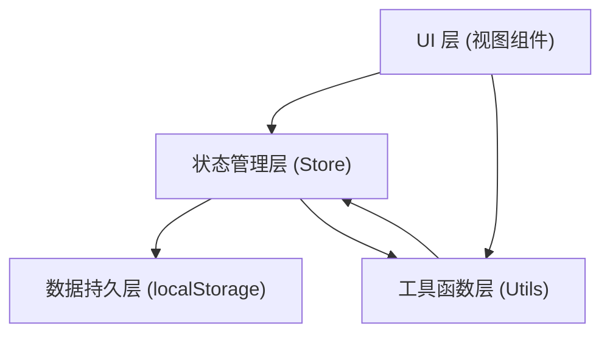
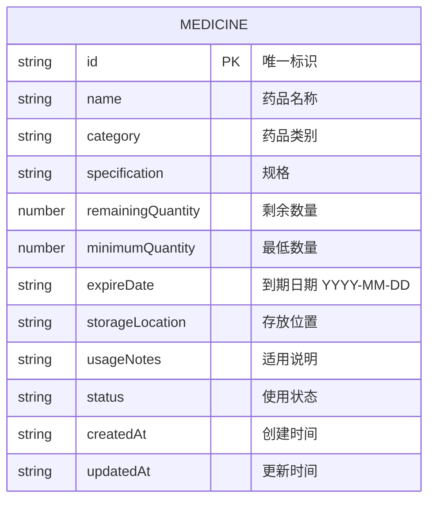

## 1. 架构设计

- **UI 层**：使用原生 TypeScript + HTML + CSS，采用组件化思想组织 DOM 渲染和事件绑定
- **状态管理层**：简单的发布订阅模式实现响应式状态更新
- **数据持久层**：封装 localStorage 读写操作，包含序列化/反序列化
- **工具函数层**：数据校验、CSV 导出、日期计算、筛选逻辑等纯函数

## 2. 技术描述

- **前端框架**：原生 TypeScript（不使用 React/Vue，按用户要求）
- **构建工具**：Vite 5.x
- **样式方案**：Tailwind CSS 3.x
- **数据存储**：浏览器 localStorage
- **图标库**：lucide（通过 CDN 或本地打包）

## 3. 模块结构

| 模块 | 文件路径 | 职责 |
|------|----------|------|
| 类型定义 | `src/types/index.ts` | 药品、筛选条件、状态枚举等类型 |
| 存储层 | `src/storage.ts` | localStorage 读写封装 |
| 状态管理 | `src/store.ts` | 应用状态、事件订阅、数据操作 |
| 工具函数 | `src/utils/` | 校验、导出、日期、筛选等工具函数 |
| UI 组件 | `src/components/` | 表格、详情面板、筛选条、汇总卡片等 |
| 主入口 | `src/main.ts` | 应用初始化、组件装配、事件绑定 |
| 样式 | `src/style.css` | Tailwind 基础样式 + 自定义样式 |

## 4. 数据模型

### 4.1 药品数据结构

### 4.2 状态枚举

- **使用状态 (status)**：
  - `normal` - 正常使用
  - `to_purchase` - 待补购
  - `purchased` - 已补购
  - `attention` - 临期关注
  - `stopped` - 停止使用

- **数量状态 (根据计算)**：
  - `sufficient` - 充足（剩余 ≥ 最低数量）
  - `low` - 偏低（剩余 < 最低数量 且 剩余 > 0）
  - `out_of_stock` - 缺货（剩余 = 0）

## 5. 数据校验规则

| 校验项 | 规则 | 处理方式 |
|--------|------|----------|
| 到期日期缺失 | `expireDate` 为空 | 警告标记，提示补充 |
| 剩余数量低于最低数量 | `remainingQuantity < minimumQuantity` | 标记为低库存，纳入补购计划 |
| 同名同规格重复 | 存在 `name` + `specification` 相同的记录 | 警告提示，允许用户确认 |
| 停止使用仍在补购计划 | `status = stopped` 且被标记为补购 | 自动从补购计划排除并警告 |
| 适用说明为空 | `usageNotes` 为空 | 警告标记，提示补充 |
| 已过期 | `expireDate < today` | 红色高亮，标记过期 |
| 临期（30天内） | `today <= expireDate <= today + 30天` | 橙色高亮，标记临期 |

## 6. 筛选条件定义

- **类别筛选**：下拉选择，从所有药品类别去重生成
- **到期月份筛选**：选择具体年月，展示该月到期的药品
- **数量状态筛选**：充足 / 偏低 / 缺货
- **存放位置筛选**：下拉选择，从所有存放位置去重生成
- **使用状态筛选**：正常使用 / 待补购 / 已补购 / 临期关注 / 停止使用
